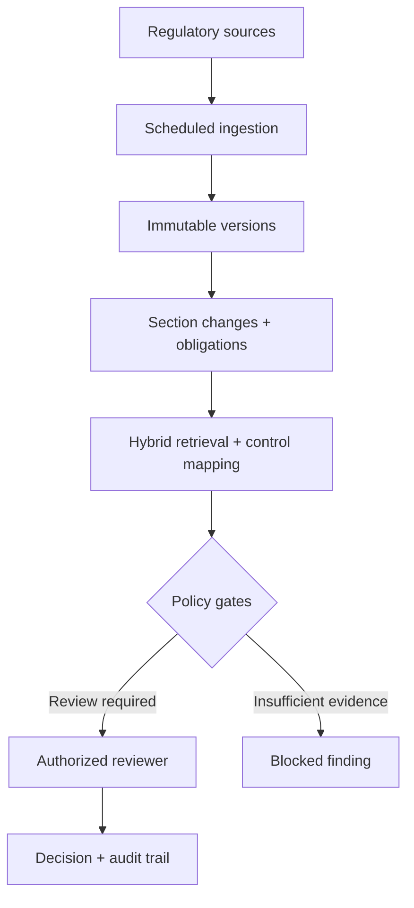
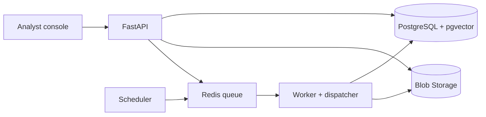
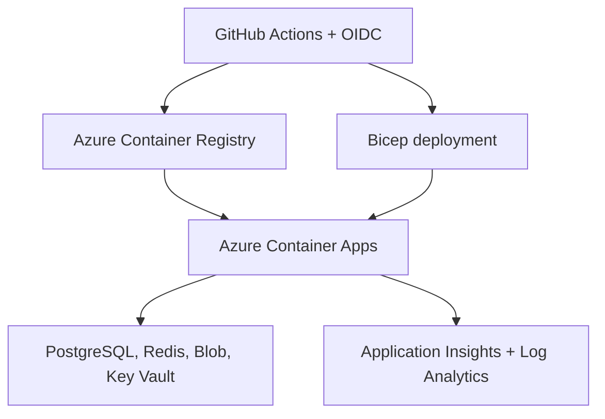

# RegImpact AI

**Regulatory Change Impact and Controls Assurance Platform**

RegImpact AI turns changing regulatory documents into evidence-linked, reviewable control-impact findings. It monitors sources, versions documents, detects section-level changes, extracts obligation candidates, retrieves relevant controls, and routes uncertain or consequential decisions to authorized reviewers.

> **Current release: v0.5.0** — verified on Azure staging with immutable deployment evidence.  
> RegImpact is an analyst-assurance platform, not a regulatory chatbot, legal-advice service, or autonomous compliance decision-maker.

[](https://github.com/chintan-02/regimpact-ai/releases/tag/v0.5.0)
[](apps/api/pyproject.toml)
[](apps/api)
[](apps/web)
[](docs/release-audit-v0.5.md)

## Why this project matters

Regulatory change is not just a search problem. Teams must prove what changed, which obligation was inferred, which controls may be affected, who reviewed the proposal, and why a decision was accepted or rejected. RegImpact treats evidence, lineage, authorization, and human accountability as first-class engineering requirements.

The project demonstrates applied AI engineering beyond a prototype:

- deterministic and evaluated document intelligence before model complexity;
- hybrid full-text and vector retrieval with citation-complete results;
- policy-gated workflow automation with mandatory human authority;
- durable asynchronous processing, tenant isolation, and append-only audit history;
- secure, repeatable Azure delivery through OIDC and infrastructure as code;
- observable, evidence-producing deployments with controlled migrations.

## Product workflow



A representative outcome is: a regulator changes an incident-reporting deadline, RegImpact identifies the old and new clauses, finds the internal control that still reflects the previous deadline, cites both sources, and presents the impact proposal for review. It does not silently alter the control.

## Verified v0.5.0 release

| Verification | Result |
| --- | --- |
| Release | [RegImpact AI v0.5.0](https://github.com/chintan-02/regimpact-ai/releases/tag/v0.5.0) |
| Deployment | [GitHub Actions run 33695340705](https://github.com/chintan-02/regimpact-ai/actions/runs/33695340705) — successful |
| Immutable commit | [`3b3d90a`](https://github.com/chintan-02/regimpact-ai/commit/3b3d90ade4b75c845395a390b00cd3d0ba20d1d0) |
| Runtime version | `0.5.0` |
| Environment | Protected GitHub `staging` environment; Azure Canada Central |
| Migration | `regimpact-staging-migrate` — succeeded |
| Workloads | API, web, worker, dispatcher, and scheduler — healthy |
| Readiness contract | `{"status":"ready","version":"0.5.0"}` |
| Evidence artifact | `deployment-evidence-3b3d90ade4b75c845395a390b00cd3d0ba20d1d0` |
| Release evidence | [v0.5.0 audit](docs/release-audit-v0.5.md) |

The API remains internal. The public web application exposes a minimal readiness route and protects analyst operations behind authentication.

## Architecture

### Application and data plane



PostgreSQL is the system of record for tenants, metadata, lineage, workflow state, and audit events. Blob Storage owns immutable source bytes. Search indexes and embeddings are derived projections that can be rebuilt.

### Azure delivery and operations



The deployment performs infrastructure validation, publishes commit-addressed images, stages workloads at zero replicas, runs the database migration job, promotes workloads only after migration success, verifies health, and retains deployment evidence.

## Core capabilities

| Area | What is implemented |
| --- | --- |
| Source monitoring | Scheduled conditional retrieval with SSRF-oriented URL controls, retries, leases, and dead-letter handling |
| Document integrity | Signature-verified PDF/HTML intake, strict limits, normalized SHA-256 identity, content-addressed storage, idempotent versioning |
| Change intelligence | Page-aware extraction and deterministic added/modified/removed section detection |
| Obligation analysis | Evidence-linked deterministic candidates, explainable confidence features, calibrated review thresholds, abstention through human-review routing |
| Retrieval | PostgreSQL full-text search, pgvector cosine similarity, reciprocal-rank fusion, tenant-scoped results, citation and embedding-model lineage |
| Control assurance | Versioned control catalogue, ranked mapping candidates, ambiguity/unmapped states, top-k and MRR evaluation |
| Human review | Accepted, rejected, deferred, and confirmed-unmapped decisions with mandatory rationale and stale-update protection |
| Controlled automation | Persisted bounded workflow, deterministic policy gates, insufficient-evidence blocking, creator/approver separation, no automatic consequential execution |
| Security | Database-backed users, admin/analyst/viewer RBAC, scrypt password hashing, short-lived signed tokens, HTTP-only cookies, tenant isolation |
| Reliability | Transactional outbox, Redis/Dramatiq workers, idempotent jobs, retries, leases, dead-letter state, startup/liveness/readiness probes |
| Observability | Structured JSON logs, request/trace/tenant/actor correlation, W3C trace context, metrics, Application Insights, Log Analytics |
| Cloud delivery | Bicep, Azure Container Apps, managed PostgreSQL, Redis, Blob Storage, ACR, Key Vault, GitHub OIDC, immutable images |

## AI/ML engineering approach

The current release deliberately favors explainable, testable components for high-consequence decisions:

- deterministic obligation extraction is evaluated and confidence-calibrated;
- hybrid retrieval combines lexical and semantic signals;
- control mappings expose evidence and ranking lineage;
- low-confidence or policy-sensitive results require human review;
- models propose; policy gates constrain; authorized people decide.

### Capability boundary

| Capability | Status |
| --- | --- |
| Sentence-transformer embeddings and hybrid retrieval | Implemented |
| Evaluated deterministic obligation extraction | Implemented |
| Persisted policy-gated workflow with human approval | Implemented |
| Fine-tuned regulatory-clause classifier | v0.6C-1 assembled and hash-locked 25 official documents; v0.6C-2 provides fail-closed human rights-review controls, while approval, annotation and genuine training remain required |
| LangGraph orchestration | **Planned for v0.7; not currently implemented** |
| AKS/Kubernetes runtime | **Planned for v1.0; not currently implemented** |

This distinction keeps portfolio claims verifiable and prevents library names from being presented as delivered engineering.

## Security and governance boundaries

- RegImpact does not provide legal advice.
- Demo authentication is disabled in Azure staging.
- Tenant and actor identity come from validated server-side credentials, never browser-supplied headers.
- The local `development_allow` malware scanner cannot run outside development; non-local environments fail closed until an enterprise scanner is configured.
- Production remains intentionally unapproved pending private networking, workforce identity, enterprise malware scanning, recovery exercises, and Kubernetes validation.
- Agent proposals cannot make consequential control or regulatory changes automatically.

## Product walkthrough

The screenshot gallery will be added after fresh v0.5.0 staging captures are sanitized. The planned sequence keeps the future visual story consistent and recruiter-friendly:

| Planned view | What it will demonstrate |
| --- | --- |
| Operations overview | Release health, queues, and operational state |
| Source registry | Monitored source history and immutable versions |
| Change evidence | Old-versus-new section comparison with citations |
| Obligation review | Evidence, confidence, and review routing |
| Control mapping | Ranked candidates, ambiguity, and rationale |
| Reviewer decision | Human authority and append-only audit state |
| Azure evidence | Successful workflow, workloads, and retained artifact |

Exact filenames, dimensions, redaction rules, and Markdown layout are documented in [the screenshot guide](docs/screenshots/README.md). No broken image placeholders are rendered before the assets exist.

## Technology

| Layer | Technologies |
| --- | --- |
| Backend | Python 3.12, FastAPI, SQLAlchemy, Alembic, Pydantic |
| Frontend | Next.js, React, TypeScript |
| Data and retrieval | PostgreSQL, pgvector, full-text search, reciprocal-rank fusion |
| Async processing | Redis, Dramatiq, transactional outbox |
| Cloud | Azure Container Apps, Flexible Server for PostgreSQL, Blob Storage, ACR, Key Vault |
| Delivery | GitHub Actions, OIDC workload identity, Bicep, Docker |
| Operations | Application Insights, Log Analytics, structured logging, metrics, tracing |

## Repository layout

```text
apps/api/          FastAPI service, domain logic, migrations, workers, and tests
apps/web/          Next.js analyst console
docs/              Architecture, security, operations, evaluation, and release evidence
infra/             Azure Bicep and environment parameters
scripts/           Deployment, validation, smoke-test, evidence, and rollback tooling
docker-compose.yml Local PostgreSQL, Redis, API, web, worker, and demo environment
```

The system is a modular monolith with independently executed web, API, worker, dispatcher, scheduler, and migration workloads. This keeps domain boundaries clear without introducing premature microservice coordination.

## Run locally

### Complete stack

```bash
cp .env.example .env
# Replace the local JWT and demo-password placeholders in .env.
docker compose up -d --build
docker compose --profile demo run --rm seed
```

Open `http://localhost:3000` and sign in with a local-only account configured in `.env`: `admin@northstar.local`, `analyst@northstar.local`, or `viewer@northstar.local`. The API and seed job receive the same required demo credentials through Compose substitution. Never commit `.env` or reuse demonstration credentials outside local development. The synthetic clauses are test fixtures, not legal or regulatory advice.

### Backend only

```bash
cd apps/api
python3 -m venv .venv
source .venv/bin/activate
pip install -e '.[dev]'
uvicorn regimpact.main:app --reload
python -m unittest discover -s tests -v
```

For frontend-only development, set `REGIMPACT_API_BASE_URL=http://localhost:8000` and run `npm run dev` from `apps/web`.

## Quality and release discipline

CI enforces backend domain tests, PostgreSQL integration tests, Ruff, mypy, frontend linting, TypeScript validation, optimized web builds, shell validation, and Bicep compilation. Run the consolidated local checks with:

```bash
make quality
```

The verified v0.5.0 release additionally passed authenticated OIDC deployment, controlled database migration, workload promotion, dependency-aware readiness, smoke tests, and immutable evidence capture.

## Roadmap

| Release | Outcome |
| --- | --- |
| v0.1 | Versioned ingestion, deterministic change detection, and citations |
| v0.2 | Obligation extraction, confidence calibration, hybrid retrieval, and control mapping |
| v0.3A | Database authentication and backend RBAC |
| v0.3B | Structured logging, metrics, tracing, and operational dashboards |
| v0.3C | Azure delivery, CI/CD, secrets, and infrastructure as code |
| v0.3D | Reliable ingestion retries, dead letters, and monitoring |
| v0.4 | Controlled impact workflow, evaluation, safety gates, and human approval |
| v0.4.1 | Responsive navigation and production-safe demo account selection |
| v0.5.0 | Verified Azure staging deployment and operational hardening |
| **v0.5.1** | **Documentation, final evidence alignment, and portfolio presentation** |
| v0.6A | Dataset construction, dual-annotation, adjudication, deduplication, and audit contracts |
| v0.6B | Audited-dataset admission, baselines, encoder training, calibration, evaluation, and artifact-promotion contracts |
| **v0.6C** | **In progress: corpus assembled; human rights-review workflow implemented; source approval, genuine labels, reproducible training, evaluation, and reviewed promotion remain** |
| v0.7 | LangGraph orchestration with persisted state, node-level retries, policy gates, and human interruption |
| v0.8 | Backup, restore, rollback, failure-injection, and reliability exercises |
| v1.0 | AKS, Helm, autoscaling, production identity/networking, and Kubernetes recovery validation |

For v0.6C, no regulatory text is admitted until source-use approval and immutable provenance are recorded; every accepted label requires two independent annotations or third-reviewer adjudication. Genuine training uses document-isolated train/validation/test splits, deterministic and classical baselines, per-class metrics, macro-F1, calibration, confidence thresholds, and human review for abstentions. For v0.7, LangGraph will coordinate steps while the deterministic policy engine remains the authority boundary.

## Project links

- [Source repository](https://github.com/chintan-02/regimpact-ai)
- [v0.5.0 release](https://github.com/chintan-02/regimpact-ai/releases/tag/v0.5.0)
- [Verified Azure deployment run](https://github.com/chintan-02/regimpact-ai/actions/runs/33695340705)
- [Release commit](https://github.com/chintan-02/regimpact-ai/commit/3b3d90ade4b75c845395a390b00cd3d0ba20d1d0)
- [Architecture](docs/architecture.md)
- [Azure deployment guide](docs/azure-deployment.md)
- [v0.5.0 release audit](docs/release-audit-v0.5.md)
- [Authentication and RBAC](docs/authentication-and-rbac.md)
- [Observability](docs/observability.md)
- [Hybrid retrieval](docs/hybrid-retrieval.md)
- [Regulatory-clause classifier](docs/clause-classifier.md)
- [Clause annotation guidelines](docs/clause-annotation-guidelines.md)
- [v0.6A dataset workspace](datasets/clause-classifier/v0.6a/README.md)
- [v0.6B training and promotion runbook](docs/clause-classifier-training-runbook.md)
- [v0.6B reproducible notebook](notebooks/v0.6b-clause-classifier.ipynb)
- [v0.6C real-corpus execution workspace](datasets/clause-classifier/v0.6c/README.md)
- [v0.6C-1 governed 25-document manifest](datasets/clause-classifier/v0.6c/corpus-manifest.json)
- [v0.6C-1 acquisition hash lock](datasets/clause-classifier/v0.6c/acquisition-lock.json)
- [v0.6C-2 rights-review runbook](docs/corpus-rights-review-runbook.md)
- [Classifier model-card template](docs/model-card-clause-classifier-template.md)
- [Analyst review workflow](docs/analyst-review-workflow.md)

## License

See [LICENSE](LICENSE).
