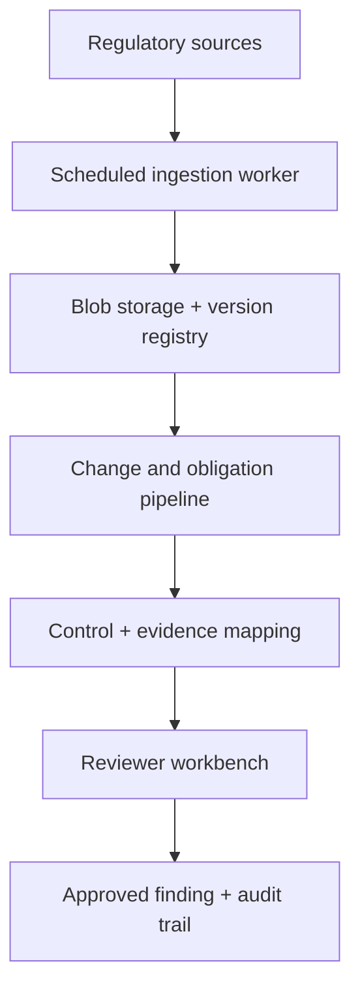

# Architecture

## Identity boundary (v0.3A)

The browser authenticates through a Next.js server route. The resulting short-lived token remains
in an HTTP-only cookie and is forwarded server-side to FastAPI. FastAPI validates token lifetime,
issuer, audience, organization, active-user state, and the current database role before resolving
tenant-scoped data. Background services retain explicit internal service identities and never use
browser credentials.

## Target system

## Deployment evolution

- v0.1–v0.4: Docker Compose locally; API, web, PostgreSQL, Redis and worker.
- v0.5: Azure Container Apps, managed PostgreSQL, Blob Storage, Key Vault, ACR and Application Insights.
- v1.0: API and workers on AKS; managed PostgreSQL and Blob Storage remain outside the cluster.

## Data ownership

PostgreSQL is the source of truth for metadata, lineage, workflow state and audit events. Blob Storage owns immutable source bytes. Search indexes and embeddings are derived, replaceable projections—not systems of record.

## Trust boundary

The agent workflow may propose findings but cannot finalize them when confidence or policy thresholds require review. Authorization is enforced in the API. Audit events are append-only at the application boundary.

## Controlled agent boundary (v0.4)

The workflow is a persisted state machine rather than an autonomous chat loop. Evidence collection,
proposal generation, policy evaluation, and human decision are explicit stages. Each citation binds
the obligation to a regulation version, section, page, source URI, content hash, and evidence quote.
Policy failure produces a blocked run. Even a passing run remains `awaiting_approval`; there is no
automatic execution transition. High-risk proposals cannot be approved by their creator.
