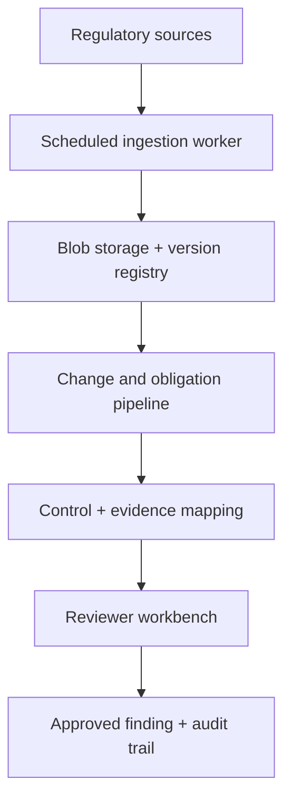

# Architecture

## Target system

## Deployment evolution

- v0.1–v0.4: Docker Compose locally; API, web, PostgreSQL, Redis and worker.
- v0.5: Azure Container Apps, managed PostgreSQL, Blob Storage, Key Vault, ACR and Application Insights.
- v1.0: API and workers on AKS; managed PostgreSQL and Blob Storage remain outside the cluster.

## Data ownership

PostgreSQL is the source of truth for metadata, lineage, workflow state and audit events. Blob Storage owns immutable source bytes. Search indexes and embeddings are derived, replaceable projections—not systems of record.

## Trust boundary

The agent workflow may propose findings but cannot finalize them when confidence or policy thresholds require review. Authorization is enforced in the API. Audit events are append-only at the application boundary.
